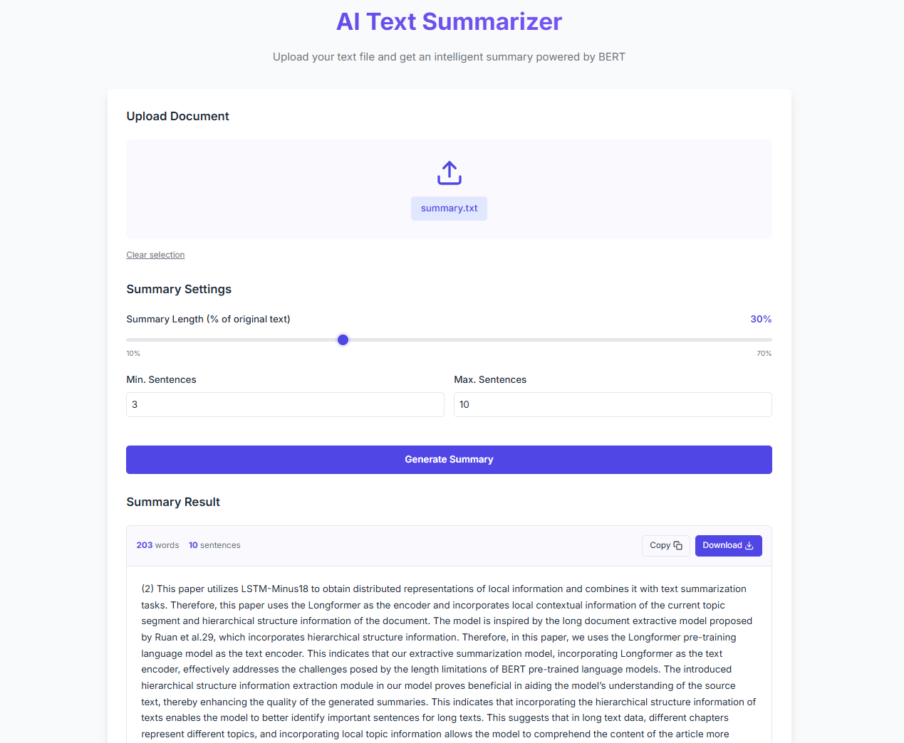

# AI Text Summarizer

An intelligent extractive text summarization tool powered by BERT (Bidirectional Encoder Representations from Transformers). This application automatically extracts the most important sentences from a text document to create a concise summary.



*Screenshot: AI Text Summarizer interface showing PDF and text file summarization*

## Features

- **BERT-based Extractive Summarization**: Utilizes BERT embeddings and TextRank algorithm to identify the most important sentences in a document
- **Adjustable Summary Length**: Control the length of your summary as a percentage of the original text
- **Min/Max Sentence Control**: Set minimum and maximum number of sentences for your summary
- **Modern UI**: Clean, responsive interface built with React and styled with CSS
- **File Upload**: Easy drag-and-drop interface for uploading text and PDF files
- **PDF Support**: Extract and summarize text from PDF documents
- **Download Summaries**: Save generated summaries as text files
- **Copy to Clipboard**: One-click copy functionality for easy sharing
- **Error Handling**: Robust error handling for invalid files and processing failures

## Project Structure

```
├── backend/               # Flask backend server
│   ├── app.py            # Main server file with BERT summarizer implementation
│   └── uploads/          # Directory for uploaded files
│
├── frontend/             # React frontend application
│   ├── public/           # Static files
│   ├── src/              # Source code
│   │   ├── components/   # React components
│   │   ├── App.jsx       # Main application component
│   │   ├── App.css       # Application styles
│   │   └── main.jsx      # Entry point
│   ├── index.html        # HTML template
│   └── vite.config.js    # Vite configuration
```

## Technology Stack

### Backend
- **Flask**: Lightweight web server framework
- **PyTorch**: Deep learning framework for BERT model
- **Transformers**: Hugging Face library for NLP models
- **NetworkX**: Graph library for TextRank algorithm implementation
- **NumPy & scikit-learn**: For numerical operations and similarity calculations
- **PyPDF2**: Library for extracting text from PDF documents
- **pdfplumber**: Advanced PDF text extraction with layout preservation

### Frontend
- **React**: UI library for building the interface
- **Vite**: Fast build tool and development server
- **TailwindCSS**: Utility-first CSS framework
- **ESLint**: Code linting and formatting

## Installation

### Prerequisites
- Python 3.8+ with pip
- Node.js 14+ with npm

### Backend Setup

1. Navigate to the backend directory:
   ```bash
   cd backend
   ```

2. Create a virtual environment (optional but recommended):
   ```bash
   python -m venv venv
   source venv/bin/activate  # On Windows: venv\Scripts\activate
   ```

3. Install the required Python packages:
   ```bash
   pip install flask flask-cors torch transformers scikit-learn networkx numpy PyPDF2 pdfplumber
   ```

4. Start the Flask server:
   ```bash
   python app.py
   ```
   The server will run on http://localhost:5000

### Frontend Setup

1. Navigate to the frontend directory:
   ```bash
   cd frontend
   ```

2. Install the required npm packages:
   ```bash
   npm install
   ```

3. Start the development server:
   ```bash
   npm run dev
   ```
   The application will be available at http://localhost:5173

## Usage

1. **Upload a File**: Drag and drop a .txt or .pdf file or click to select one from your computer
2. **Adjust Summary Settings**:
   - Set the summary length as a percentage of the original text (10% to 70%)
   - Set minimum and maximum number of sentences
3. **Generate Summary**: Click the "Generate Summary" button
4. **View and Save Results**:
   - Read the generated summary
   - Copy to clipboard or download as a text file

## Error Handling and Troubleshooting

The application includes robust error handling to ensure a smooth user experience:

### File Upload Validation
- **File Type Validation**: Only .txt and .pdf files are accepted
- **File Size Limit**: Files larger than 10MB will be rejected to prevent server overload
- **Empty File Detection**: Empty files are detected and appropriate error messages are displayed

### PDF Processing
- **PDF Text Extraction**: The system attempts multiple extraction methods if the primary method fails
- **Corrupt PDF Detection**: Corrupted PDF files are identified and appropriate error messages are shown
- **Password-Protected PDFs**: The system detects password-protected PDFs and notifies the user

### Summarization Safeguards
- **Minimum Content Check**: Ensures there's enough text to summarize
- **Language Detection**: Warns if the text might not be in a supported language
- **Timeout Protection**: Long-running summarization tasks are gracefully handled

### Common Issues and Solutions

| Issue | Possible Solution |
|-------|-------------------|
| "File type not allowed" | Ensure you're uploading a .txt or .pdf file |
| "Failed to extract text from PDF" | The PDF might be corrupted or password-protected |
| "Text too short to summarize" | The document doesn't contain enough text for meaningful summarization |
| "Server timeout" | Try with a smaller document or adjust the summary settings |

## How It Works

The summarization process follows these steps:

1. **File Processing**:
   - For text files: Content is read directly
   - For PDF files: Text is extracted using PyPDF2 and pdfplumber with layout preservation
2. **Text Preprocessing**: The input text is split into sentences
3. **BERT Embeddings**: Each sentence is converted into a vector representation using BERT
4. **Similarity Matrix**: Cosine similarity is calculated between all sentence pairs
5. **TextRank Algorithm**: A graph is constructed where nodes are sentences and edges are weighted by similarity
6. **Sentence Ranking**: PageRank algorithm identifies the most important sentences
7. **Summary Generation**: Top-ranked sentences are extracted and presented in their original order

## License

This project is licensed under the MIT License - see the LICENSE file for details.
