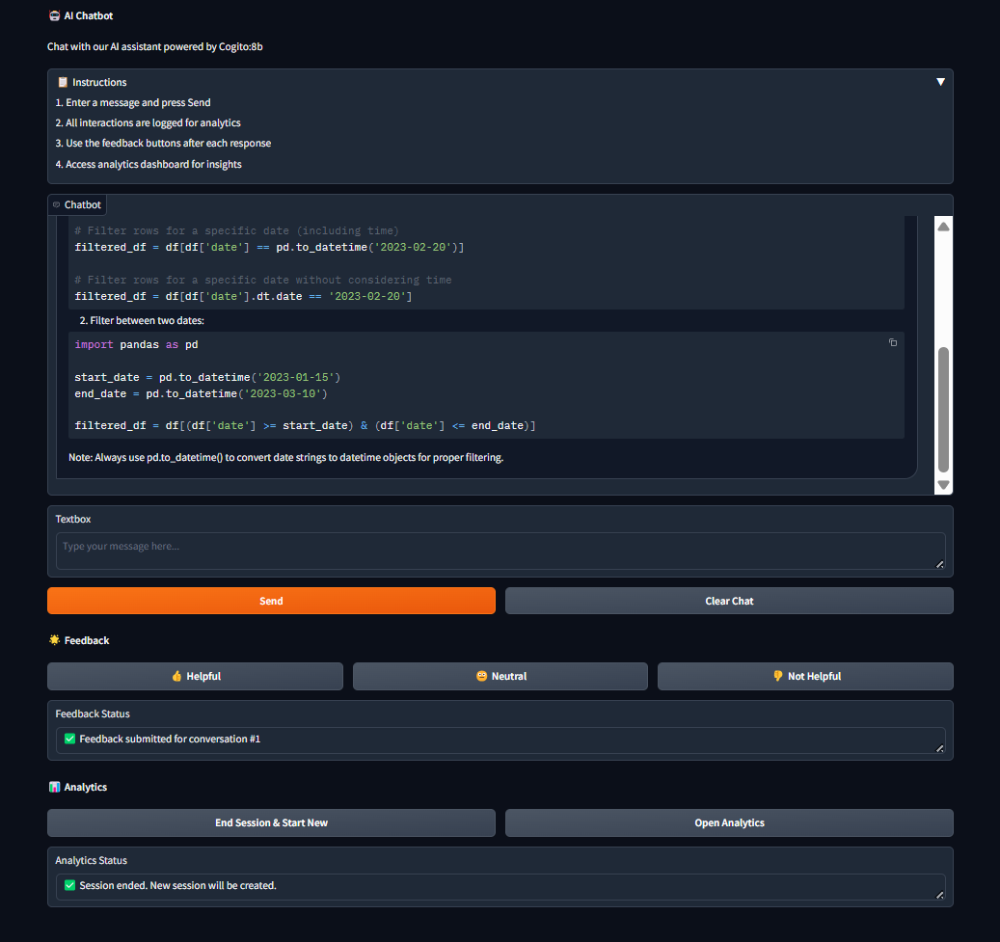
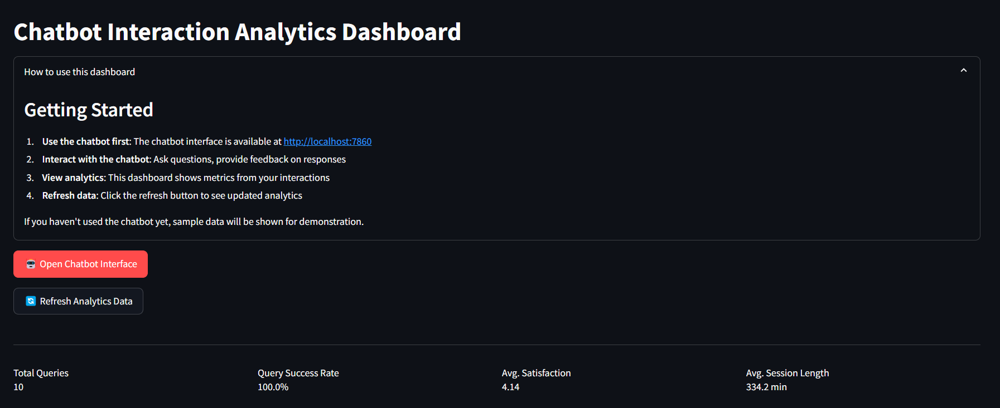
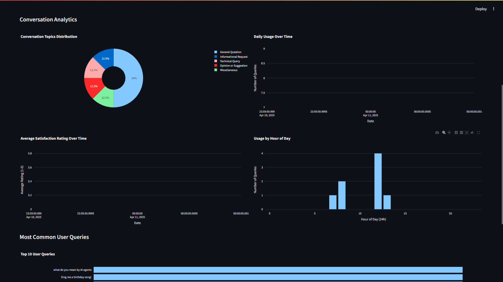

# 🤖 Chatbot Analytics System

A comprehensive system for chatbot interactions and analytics, featuring a user-friendly chat interface and a detailed analytics dashboard.

## 📋 Overview

This project combines an AI-powered chatbot with an analytics dashboard to track user interactions, satisfaction ratings, and conversation topics. The system is designed to help understand user engagement patterns and improve the chatbot's performance over time.

## ✨ Features

### Chatbot Interface
- Interactive chat interface powered by Cogito:8b LLM
- Clean, concise responses without thinking process
- Quick feedback submission with thumbs up/down buttons
- Session management for tracking conversation history
- Topic classification for better analytics

### Analytics Dashboard
- Real-time metrics on user interactions
- Satisfaction ratings over time
- Topic distribution visualization
- Session duration analysis
- Conversation success rate tracking
- Detailed data tables for in-depth analysis

## 🖼️ Screenshots

### Chatbot Interface

*The chatbot interface with clean responses and easy feedback options*

### Analytics Dashboard - Overview


### Analytics Dashboard - Visualizations

*The analytics dashboard showing key metrics and visualizations*

## 🚀 Getting Started

### Prerequisites
- Python 3.9+
- Conda (recommended for environment management)
- Ollama with Cogito:8b model installed

### Installation

1. Clone the repository:
```bash
git clone https://github.com/AlokTheDataGuy/chatbot-analytics-system.git
cd chatbot-analytics-system
```

2. Create and activate a conda environment:
```bash
conda create -n chatbot_analytics python=3.9
conda activate chatbot_analytics
```

3. Install the required packages:
```bash
pip install -r requirements.txt
```

4. Make sure Ollama is running with the Cogito:8b model:
```bash
ollama run cogito:8b
```

### Running the System

1. Start the complete system (both chatbot and dashboard):
```bash
python main.py
```

2. Or run components individually:
```bash
# Run only the chatbot
python main.py --mode chatbot

# Run only the dashboard
python main.py --mode dashboard
```

3. Access the interfaces:
   - Chatbot: http://localhost:7860
   - Dashboard: http://localhost:8501

## 📊 System Architecture

The system consists of three main components:

1. **Chatbot Interface**: Built with Gradio, provides a user-friendly interface for interacting with the AI
2. **Analytics Dashboard**: Built with Streamlit, visualizes interaction data and metrics
3. **Database**: SQLite database for storing conversation history, feedback, and session data

## 🛠️ Technologies Used

- **LLM**: Cogito:8b via Ollama
- **Frontend**: Gradio (chatbot) and Streamlit (dashboard)
- **Database**: SQLite
- **Data Visualization**: Plotly
- **Data Processing**: Pandas

## 📝 Notes

- The system automatically creates a database if one doesn't exist
- Sample data is shown in the dashboard if no real interactions are available
- All user interactions are logged for analytics purposes
- The dashboard can be refreshed to see the latest data

## 🤝 Contributing

Contributions, issues, and feature requests are welcome! Feel free to check the issues page.

## 📄 License

This project is licensed under the MIT License - see the LICENSE file for details.

## 🙏 Acknowledgements

- Ollama for providing the LLM infrastructure
- Gradio and Streamlit for the frontend frameworks
- The open-source community for various libraries used in this project
