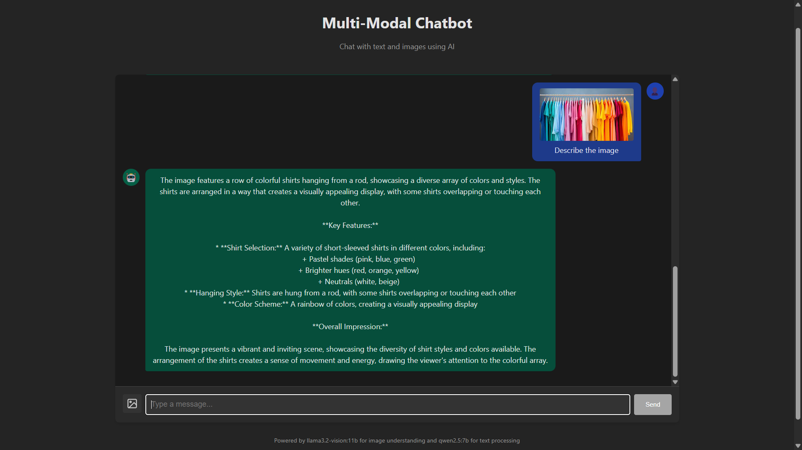

# Multi-Modal Chatbot

A chatbot that can understand both text and image inputs, providing seamless multi-modal interactions.

## Screenshots

### Text Generation


### Image Understanding


## Features

- Text-based conversation with AI
- Image understanding and analysis
- Seamless integration of text and visual content

## Architecture

The chatbot follows this flow:

1. User sends input (text, image, or both) via the UI
2. API Gateway validates the request and passes it to the Input Classifier
3. Input Classifier determines required processing types and sends to Task Dispatcher
4. Task Dispatcher creates specific tasks and sends them to appropriate models
5. Models process their assigned tasks
6. Response Aggregator collects all outputs and creates a coherent response
7. API Gateway returns the unified response to the UI


## Models Used

- **Text Processing**: qwen2.5:7b (via Ollama)
- **Image Understanding**: llama3.2-vision:11b (via Ollama)

## Prerequisites

- Python 3.9+
- Node.js 16+
- [Ollama](https://ollama.ai/) installed locally

## Setup

### 1. Install Ollama and required models

Download and install Ollama from [ollama.ai](https://ollama.ai/), then pull the required models:

```bash
ollama pull llama3.2-vision:11b
ollama pull qwen2.5:7b
```

### 2. Set up the backend

```bash
# Install dependencies
pip install -r requirements.txt

# Run the backend server
cd backend
python run.py
```

The backend server will run at http://localhost:8000

### 3. Set up the frontend

```bash
# Install dependencies
cd frontend
npm install

# Run the development server
npm run dev
```

The frontend will be available at http://localhost:3000

## Usage

1. Open your browser and navigate to http://localhost:3000
2. Type a message or upload an image (or both)
3. The chatbot will process your input and respond accordingly
4. You can ask questions about uploaded images to get AI analysis

## Project Structure

```
multi-modal-chatbot/
├── backend/
│   ├── app.py                 # FastAPI main application
│   ├── run.py                 # Script to run the backend server
│   ├── models/
│   │   ├── image_processor.py # llama3.2-vision:11b integration
│   │   └── text_processor.py  # qwen2.5:7b integration
│   ├── services/
│   │   ├── input_classifier.py
│   │   ├── task_dispatcher.py
│   │   └── response_aggregator.py
│   └── utils/
│       └── helpers.py
├── frontend/
│   ├── src/
│   │   ├── components/
│   │   │   ├── ChatInterface.jsx
│   │   │   ├── MessageList.jsx
│   │   │   ├── MessageItem.jsx
│   │   │   ├── ImageUpload.jsx
│   │   │   └── ImageDisplay.jsx
│   │   ├── services/
│   │   │   └── api.js
│   │   ├── App.jsx
│   │   └── main.jsx
│   └── package.json
└── README.md
```

## Notes

- The chatbot stores uploaded images in the `uploads` directory, which are automatically cleaned up after 24 hours
- For better performance when analyzing large images, they are automatically resized while preserving aspect ratio
