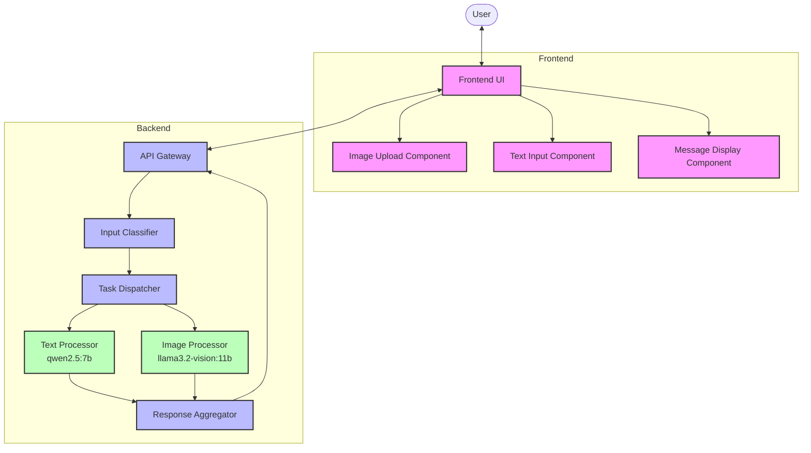

```mermaid
flowchart TD
    User([User]) <--> UI[Frontend UI]
    
    subgraph Frontend
        UI --> ImageUpload[Image Upload Component]
        UI --> TextInput[Text Input Component]
        UI --> MessageDisplay[Message Display Component]
    end
    
    UI <--> API[API Gateway]
    
    subgraph Backend
        API --> InputClassifier[Input Classifier]
        InputClassifier --> TaskDispatcher[Task Dispatcher]
        
        TaskDispatcher --> TextProcessor[Text Processor\nqwen2.5:7b]
        TaskDispatcher --> ImageProcessor[Image Processor\nllama3.2-vision:11b]
        
        TextProcessor --> ResponseAggregator[Response Aggregator]
        ImageProcessor --> ResponseAggregator
        
        ResponseAggregator --> API
    end
    
    classDef frontend fill:#f9f,stroke:#333,stroke-width:2px
    classDef backend fill:#bbf,stroke:#333,stroke-width:2px
    classDef models fill:#bfb,stroke:#333,stroke-width:2px
    
    class UI,ImageUpload,TextInput,MessageDisplay frontend
    class API,InputClassifier,TaskDispatcher,ResponseAggregator backend
    class TextProcessor,ImageProcessor models
```
