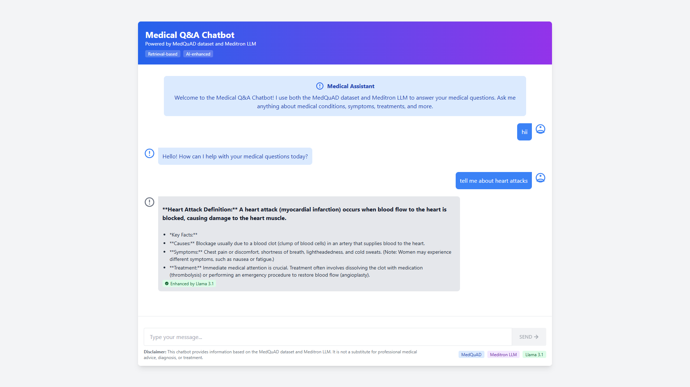

# Medical Q&A Chatbot

A modern medical question-answering chatbot that provides appropiate, relevant, and user-friendly medical information using a combination of retrieval-based methods and large language models.



## Features

- **Hybrid Retrieval System**: Combines MedQuAD dataset with Meditron LLM for accurate medical information
- **Enhanced Responses**: Uses Llama 3.1 (8B) to improve clarity and readability of medical information
- **Entity Recognition**: Highlights important medical terms and concepts
- **Conversational Interface**: Natural conversation capabilities for a better user experience
- **Responsive Design**: Clean, modern UI with Tailwind CSS
- **Loading Indicators**: Visual feedback during response generation

## Architecture

The application consists of two main components:

### Backend (FastAPI)

- **Query Processing**: Processes and optimizes user questions
- **Entity Recognition**: Identifies medical entities in text
- **Retrieval Service**: Searches the MedQuAD dataset for relevant information
- **LLM Integration**: Uses Meditron for medical knowledge and Llama 3.1 for response enhancement
- **Conversation Service**: Handles basic conversational interactions

### Frontend (React + TypeScript)

- **Chat Interface**: Modern, responsive chat UI
- **Message Formatting**: Properly formats and displays medical information
- **Entity Highlighting**: Visually highlights medical terms
- **Loading States**: Provides visual feedback during processing

## Project Structure

```
medical-qa-chatbot/
├── backend/               # FastAPI backend
│   ├── app/
│   │   ├── api/           # API endpoints
│   │   ├── services/      # Business logic
│   │   ├── utils/         # Utility functions
│   │   └── main.py        # Application entry point
│   └── run.py             # Server startup script
├── frontend/              # React frontend
│   ├── src/
│   │   ├── components/    # React components
│   │   ├── services/      # API services
│   │   ├── types/         # TypeScript types
│   │   └── App.tsx        # Main application component
│   └── index.html         # HTML entry point
└── data/                  # Data files and indexes
```

## Setup and Installation

### Prerequisites

- Node.js (v16+)
- Python (v3.9+)
- Ollama (for running local LLMs)

### Backend Setup

1. Navigate to the backend directory:
   ```
   cd backend
   ```

2. Create a virtual environment:
   ```
   python -m venv venv
   source venv/bin/activate  # On Windows: venv\Scripts\activate
   ```

3. Install dependencies:
   ```
   pip install -r requirements.txt
   ```

4. Start the backend server:
   ```
   python run.py
   ```

### Frontend Setup

1. Navigate to the frontend directory:
   ```
   cd frontend
   ```

2. Install dependencies:
   ```
   npm install
   ```

3. Start the development server:
   ```
   npm run dev
   ```

### LLM Setup

1. Install Ollama from [https://ollama.ai/](https://ollama.ai/)

2. Pull the required models:
   ```
   ollama pull meditron:7b
   ollama pull llama3.1:8b
   ```

## Usage

1. Open your browser and navigate to `http://localhost:5173`
2. Type a medical question in the input field
3. The system will:
   - Process your question
   - Search for relevant medical information
   - Enhance the response for better readability
   - Display the answer with highlighted medical terms

## Response Types

The chatbot provides different types of responses:

- **Medical Information**: Structured, concise answers to medical questions
- **Conversational Responses**: Natural replies to greetings and simple questions
- **Not Available Responses**: Clear indication when information is not available

## Technologies Used

- **Frontend**: React, TypeScript, Tailwind CSS, Vite
- **Backend**: FastAPI, Python
- **LLMs**: Meditron 7B, Llama 3.1 8B (via Ollama)
- **Data**: MedQuAD (Medical Question Answering Dataset)

## Disclaimer

This chatbot provides information based on the MedQuAD dataset and AI language models. It is not a substitute for professional medical advice, diagnosis, or treatment. Always consult with a qualified healthcare provider for medical concerns.
