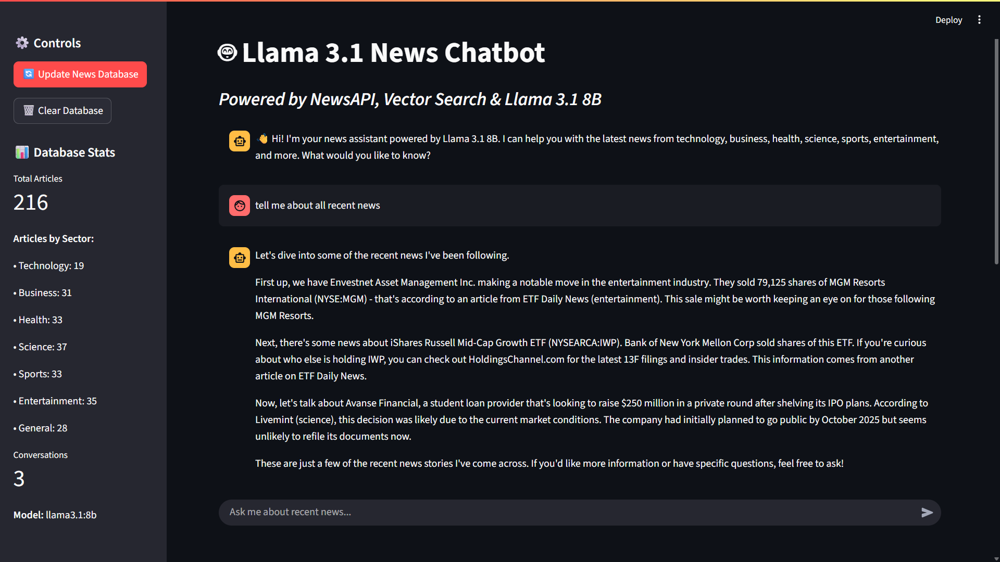
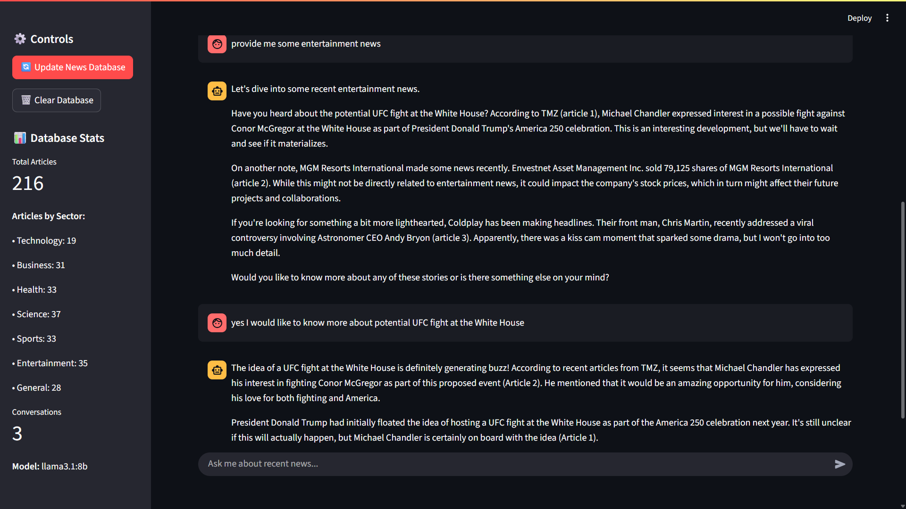

# 🤖 Dynamic News Chatbot with Llama 3.1 8B


> **An intelligent news chatbot that automatically updates its knowledge base with fresh articles and provides conversational interactions powered by Llama 3.1 8B.**

## Screenshots





## 🌟 Features

### **🔄 Dynamic Knowledge Base**

- **Automatic Updates**: Fetches fresh news every 12 hours from multiple sectors
- **Smart Web Scraping**: Full article content extraction beyond just headlines
- **Vector Storage**: ChromaDB for efficient similarity search and retrieval
- **Resource Efficient**: Uses only 7/1000 daily NewsAPI requests per update


### **🧠 Advanced AI Capabilities**

- **Local LLM**: Privacy-focused with Llama 3.1 8B running entirely offline
- **Contextual Responses**: Retrieval-Augmented Generation (RAG) with real news data
- **Multi-turn Conversations**: Maintains context throughout chat sessions
- **Source Attribution**: Cites articles and sources in responses


### **📰 Multi-Sector Coverage**

- **Technology** - AI, startups, software, innovations
- **Business** - Finance, markets, economy, companies
- **Health** - Medical research, healthcare, wellness
- **Science** - Research, discoveries, scientific breakthroughs
- **Sports** - Athletics, games, tournaments, player news
- **Entertainment** - Movies, music, celebrities, hollywood
- **General** - Breaking news, current events, trending topics


### **💻 User Experience**

- **Streamlit Chat Interface** - Modern, responsive web UI
- **Real-time Statistics** - Database metrics and conversation analytics
- **Manual Updates** - On-demand news refresh capability
- **Session Memory** - Persistent chat history per user


## 🏗️ System Architecture

```
┌─────────────────┐    ┌──────────────────┐    ┌─────────────────┐
│    NewsAPI      │───▶│   Web Scraper    │───▶│  ChromaDB       │
│  (7 requests)   │    │  (newspaper3k)   │    │  (Vectors)      │
└─────────────────┘    └──────────────────┘    └─────────────────┘
                                                        │
                                                        ▼
┌─────────────────┐    ┌──────────────────┐    ┌─────────────────┐
│   Streamlit     │◀───│  Llama 3.1 8B    │◀───│ Context Search  │
│     Web UI      │    │    (Ollama)      │    │   (RAG Query)   │
└─────────────────┘    └──────────────────┘    └─────────────────┘
```


## 📋 Prerequisites

- **Python 3.8+** with pip package manager
- **8GB+ RAM** for running Llama 3.1 8B model locally
- **NewsAPI Account** - Free tier provides 1000 requests/day
- **Ollama** - For running Llama 3.1 8B locally
- **Internet Connection** - For fetching news articles and web scraping


## ⚡ Quick Start

### 1. **Clone Repository \& Install Dependencies**

```bash
git clone <your-repo-url>
cd dynamic-news-chatbot

# Install Python dependencies
pip install -r requirements.txt
```


### 2. **Install Ollama \& Pull Model**

```bash
# Install Ollama (Linux/macOS)
curl -fsSL https://ollama.ai/install.sh | sh

# Or visit https://ollama.ai/download for Windows

# Pull Llama 3.1 8B model (4.9GB download)
ollama pull llama3.1:8b
```


### 3. **Configure NewsAPI**

```bash
# Get free API key from newsapi.org
# Create .env file
echo "NEWS_API_KEY=your_api_key_here" > .env
```


### 4. **Launch the Chatbot**

```bash
streamlit run streamlit_app.py
```

Visit `http://localhost:8501` to access your news chatbot!

## 🔧 Configuration

### **Environment Variables (.env)**

```bash
# Required: NewsAPI key (free from newsapi.org)
NEWS_API_KEY=your_free_api_key_here

# Optional: Custom settings
UPDATE_INTERVAL_HOURS=12
DB_PATH=./chroma_news_db
MAX_ARTICLES_PER_SECTOR=5
```


### **Customizing News Sources**

Edit `news_scraper.py` to modify sectors and search queries:

```python
sector_queries = {
    'technology': 'technology OR tech OR software OR AI OR startup',
    'your_custom_sector': 'your custom search terms'
}
```


## 📊 Usage \& API Efficiency

### **Daily API Usage Breakdown**

- **7 API calls per update** (1 per sector)
- **35 articles per update** (5 per sector)
- **993 requests remaining** for additional updates
- **Perfect for free tier** - stay well within 1000 daily limit


### **Chat Interface Commands**

- Ask about recent news: *"What's new in technology?"*
- Sector-specific queries: *"Tell me about health developments"*
- Follow-up questions: *"Can you explain more about that?"*
- Source requests: *"Which articles mention this?"*


### **Admin Controls**

- **🔄 Update Database** - Manually fetch fresh articles
- **📊 View Statistics** - Database metrics and conversation analytics
- **⚙️ Settings Panel** - Monitor system status and performance


## 📁 Project Structure

```
dynamic-news-chatbot/
├── 📄 streamlit_app.py      # Main Streamlit web interface
├── 📰 news_scraper.py       # NewsAPI integration & web scraping
├── 🗄️ vector_database.py    # ChromaDB vector storage manager
├── 🦙 llama_chat.py         # Llama 3.1 8B integration & RAG
├── ⏰ scheduler.py          # Background update scheduling
├── 📋 requirements.txt      # Python dependencies
├── ⚙️ .env                  # Environment configuration
├── 📚 README.md            # Project documentation
├── 🗃️ chroma_news_db/      # Vector database storage
├── 📸 screenshots/         # UI screenshots & demos
└── 🔧 __pycache__/         # Python cache files
```


## 🔬 Technical Details

### **Core Technologies**

- **Streamlit** - Web interface with chat components
- **NewsAPI** - Article URL collection (free tier: 1000 requests/day)
- **newspaper3k + BeautifulSoup** - Full content web scraping
- **ChromaDB** - Vector database with sentence transformers
- **Ollama** - Local LLM deployment for Llama 3.1 8B
- **SentenceTransformers** - Text embeddings (all-MiniLM-L6-v2)


### **Data Pipeline**

1. **Collection** - NewsAPI fetches article URLs by sector
2. **Scraping** - Extract full article content from URLs
3. **Processing** - Clean text and create semantic chunks
4. **Embedding** - Generate vectors using sentence transformers
5. **Storage** - Store in ChromaDB with metadata
6. **Retrieval** - Similarity search for user queries
7. **Generation** - Llama 3.1 8B creates contextual responses

### **Performance Optimizations**

- **Chunking Strategy** - 500-character semantic chunks for better retrieval
- **Batch Processing** - Efficient vector database updates
- **Rate Limiting** - Respectful web scraping with delays
- **Caching** - Streamlit resource caching for faster loads
- **Local Processing** - All AI inference runs offline


## 🎯 Use Cases

### **For News Enthusiasts**

- Get personalized news summaries from multiple sources
- Ask follow-up questions about current events
- Discover connections between different news stories
- Access news in a conversational, interactive format


### **For Developers**

- Template for building knowledge-base chatbots
- Example of Streamlit chat interface implementation
- ChromaDB vector database usage patterns
- Ollama integration for local AI models


## 🚀 Advanced Features

### **Scheduled Updates**

Enable automatic news updates every 12 hours:

```python
# In scheduler.py
schedule.every(12).hours.do(update_knowledge_base)
```


### **Custom Sectors**

Add your own news categories:

```python
# Add to news_scraper.py
self.sectors.append('cryptocurrency')
sector_queries['cryptocurrency'] = 'crypto OR bitcoin OR blockchain'
```


### **Model Switching**

Change the AI model:

```bash
# Pull different model
ollama pull llama2:13b

# Update in llama_chat.py
LlamaNewsBot(vector_db, model_name="llama2:13b")
```


## 📈 Monitoring \& Analytics

### **Database Statistics**

- Total articles stored
- Articles per sector breakdown
- Last update timestamp
- Vector database size


### **Conversation Metrics**

- Total conversations handled
- Active users
- Average response time
- Source citation frequency


## 🛠️ Troubleshooting

### **Common Issues**

**❌ "Model not found" error**

```bash
# Ensure Llama model is pulled
ollama pull llama3.1:8b
ollama list  # Verify installation
```

**❌ "NewsAPI 400 error"**

- Check API key validity at newsapi.org
- Ensure .env file exists with correct key
- Verify daily request limit not exceeded

**❌ "ChromaDB connection error"**

- Delete `chroma_news_db/` folder and restart
- Check disk space availability
- Ensure write permissions in project directory

**❌ "Article scraping fails"**

- Some news sites block scraping - this is normal
- System falls back to article descriptions
- Rate limiting prevents server overload


## 🤝 Contributing

This project is perfect for learning and experimentation! Feel free to:

- **Add new news sectors** and search categories
- **Improve scraping logic** for better content extraction
- **Enhance the UI** with additional Streamlit components
- **Optimize vector search** with different embedding models
- **Add conversation features** like chat history export


## 📄 License

This project is open source and available under the MIT License. Perfect for educational use, portfolio projects, and further development.


## 🚀 Ready to Chat with the News?

```bash
streamlit run streamlit_app.py
```

**Your intelligent news assistant is waiting at `http://localhost:8501`!**

Ask anything about recent news, and watch as the system retrieves relevant articles, processes them with Llama 3.1 8B, and provides you with informed, conversational responses backed by real news sources.

**Perfect for data scientists, developers, and news enthusiasts who want to experience the future of news consumption!** 🌟

