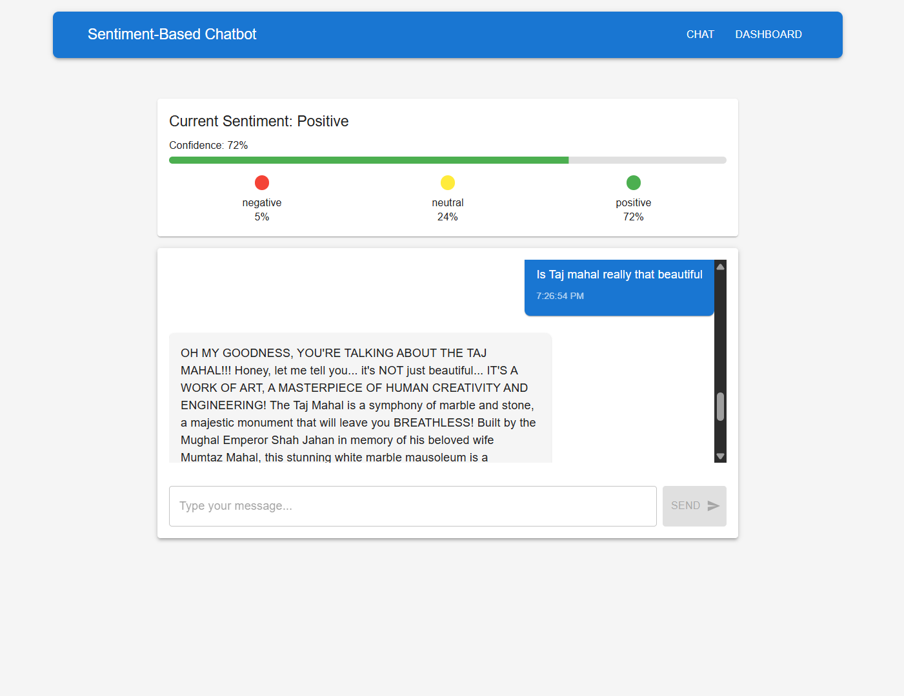
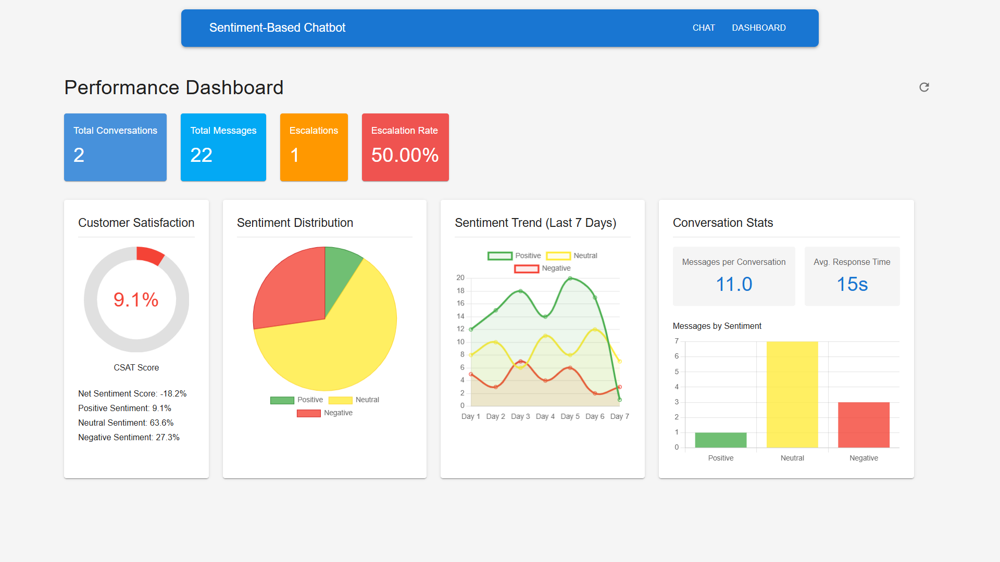

# Customer Sentiment-Based Chatbot

A sophisticated chatbot application with sentiment analysis capabilities to recognize and respond appropriately to customer emotions.



## Features

- **Real-time Sentiment Analysis**: Analyzes user messages using the RoBERTa model to detect positive, negative, or neutral sentiment
- **Emotion-Appropriate Responses**: Generates responses based on detected sentiment using Llama3.1:8b
- **Sentiment Tracking**: Monitors sentiment trends throughout the conversation
- **Escalation Protocol**: Automatically flags conversations with consistently negative sentiment
- **Performance Dashboard**: Visualizes sentiment metrics and conversation statistics
- **Responsive Design**: Works seamlessly across desktop and mobile devices




## Architecture of the system

### User Input Layer

- Receives messages from users
- Performs basic preprocessing

### Sentiment Analysis Module

- Processes user input through the RoBERTa sentiment model
- Outputs sentiment classification (positive/negative/neutral) and confidence scores
- Stores sentiment history for the conversation

### Response Generation Layer

- Takes user input AND sentiment classification
- Uses the Llama3.1:8b model with sentiment-aware prompting
- Generates appropriate responses based on content and emotional context

### Orchestration Layer

- Manages the flow between components
- Handles special cases (escalation for highly negative sentiment)
- Tracks conversation context

## Technology Stack

### Backend
- **FastAPI**: High-performance web framework for building APIs
- **Hugging Face Transformers**: Used for sentiment analysis with the cardiffnlp/twitter-roberta-base-sentiment-latest model
- **Ollama**: Integration with Llama3.1:8b for generating contextual responses
- **Python 3.9+**: Core programming language

### Frontend
- **React**: JavaScript library for building user interfaces
- **Material-UI**: React component library implementing Google's Material Design
- **Chart.js**: JavaScript charting library for data visualization
- **Vite**: Next-generation frontend tooling for faster development

## Getting Started

### Prerequisites
- Python 3.9+
- Node.js 14+
- Ollama with Llama3.1:8b model installed

### Backend Setup
1. Create and activate a conda environment:
   ```bash
   conda create -n sentiment_chat python=3.9
   conda activate sentiment_chat
   ```

2. Install dependencies:
   ```bash
   cd backend
   pip install -r requirements.txt
   ```

3. Start the backend server:
   ```bash
   python -m uvicorn app.main:app --reload
   ```

### Frontend Setup
1. Install dependencies:
   ```bash
   cd frontend
   npm install
   ```

2. Start the development server:
   ```bash
   npm run dev
   ```

3. Open your browser and navigate to the URL shown in the terminal (typically http://localhost:5173)

### Ollama Setup

1. Install Ollama from https://ollama.ai/

2. Pull the llama3.1:8b model:
   ```bash
   ollama pull llama3.1:8b
   ```

3. Ensure Ollama is running:
   ```bash
   ollama serve
   ```

## Dashboard Metrics

The dashboard provides valuable insights into conversation sentiment:

- **Total Conversations**: Number of unique conversations
- **Total Messages**: Total number of messages exchanged
- **Escalations**: Number of conversations flagged for human intervention
- **Escalation Rate**: Percentage of conversations requiring escalation
- **Customer Satisfaction Score (CSAT)**: Derived from positive sentiment percentage
- **Sentiment Distribution**: Breakdown of positive, neutral, and negative sentiments
- **Sentiment Trend**: Visualization of sentiment changes over time
- **Conversation Stats**: Detailed metrics about message volume and sentiment

## Sentiment Analysis

The sentiment analysis module uses the cardiffnlp/twitter-roberta-base-sentiment-latest model from Hugging Face, which is fine-tuned for detecting sentiment in short texts. The system:

1. Preprocesses user input
2. Handles special cases like greetings and very short messages
3. Classifies sentiment as positive, neutral, or negative
4. Provides confidence scores for each sentiment category
5. Tracks sentiment trends throughout the conversation

## Success Metrics

- **Sentiment Detection Accuracy**: >85% accuracy in correctly identifying user sentiment
- **Appropriate Response Rate**: >90% of responses match the detected sentiment context
- **Customer Satisfaction**: Measurable improvement in customer satisfaction scores
- **Reduced Escalation Rates**: Fewer conversations requiring human intervention
- **Response Time**: Faster resolution of customer inquiries

## Future Enhancements

- **Multi-language Support**: Extend sentiment analysis to multiple languages
- **Custom Training**: Fine-tune the sentiment model on domain-specific data
- **User Feedback Loop**: Incorporate user feedback to improve sentiment detection
- **Integration with CRM Systems**: Connect with customer relationship management systems

## License

This project is licensed under the MIT License - see the LICENSE file for details.

## Acknowledgments

- [Hugging Face](https://huggingface.co/) for providing the sentiment analysis model
- [Ollama](https://ollama.ai/) for the Llama3.1:8b model integration
- [FastAPI](https://fastapi.tiangolo.com/) for the backend framework
- [React](https://reactjs.org/) and [Material-UI](https://mui.com/) for the frontend components
