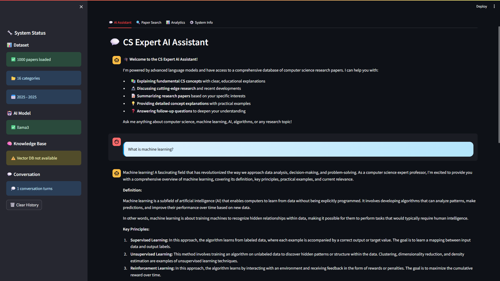
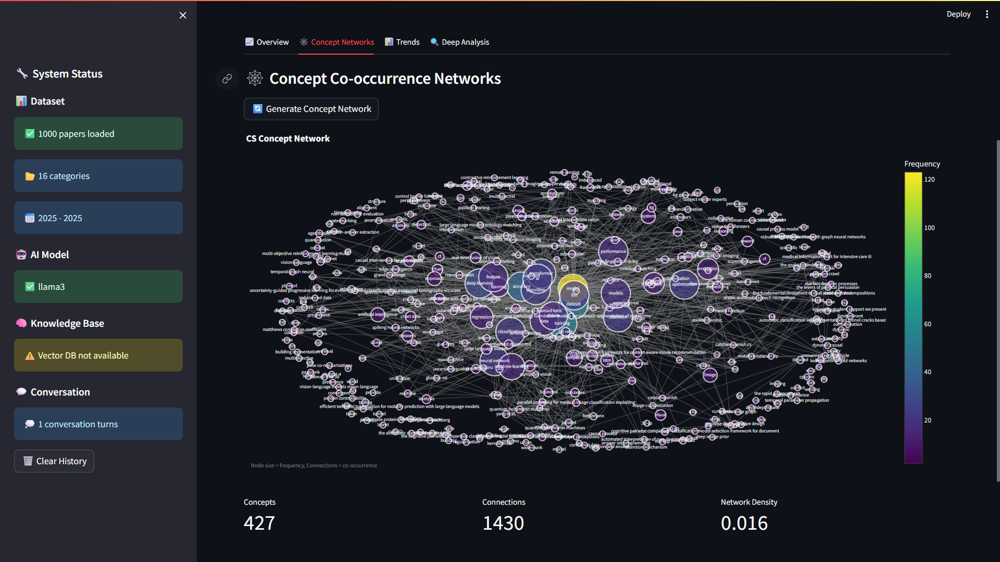
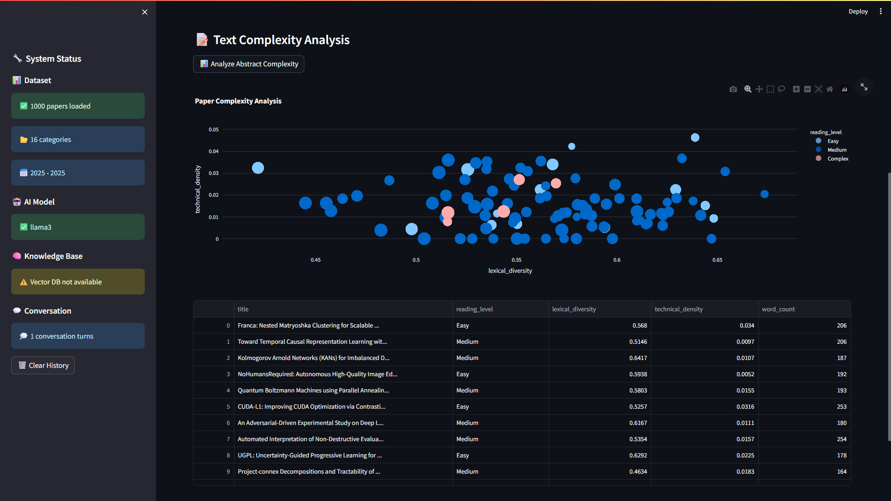
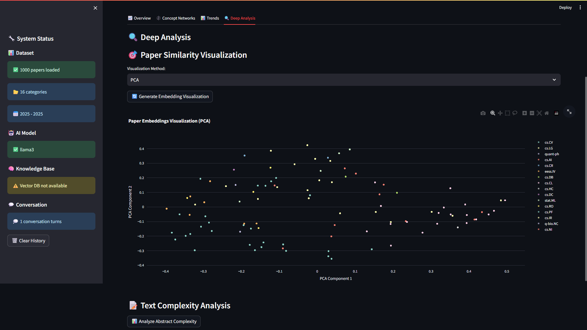
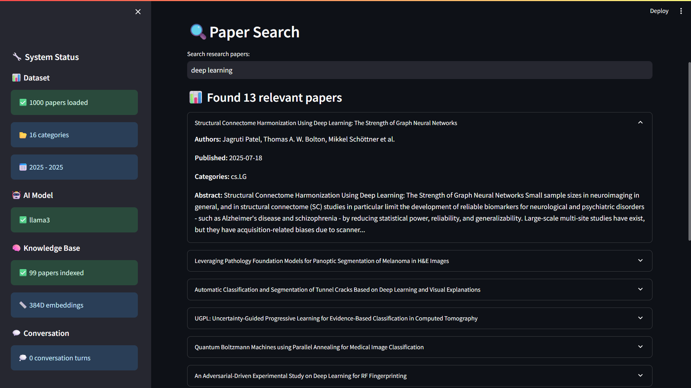

# 🤖 CS Expert AI Assistant  
**CS Expert Chatbot powered by an open-source foundation LLM (Llama 3) + Retrieval Augmented Generation (RAG)**  

## Screenshots












### Why you’ll love it 💜  

| Feature | What you get |
|---------|--------------|
| **Foundation LLM with built-in CS knowledge** | Runs locally with **Llama 3** (via [Ollama](https://ollama.ai/)) – no keys, no cost |
| **Retrieval-Augmented Generation** | Semantic search over **arXiv** CS papers (AI, ML, CV, NLP, DB…) stored in a **ChromaDB** vector DB |
| **Deep NLP toolkit** | Summarisation (BART-CNN), extractive QA (RoBERTa-SQuAD2), keyword & entity extraction, complexity analysis |
| **Beautiful Streamlit UI** | Chat, advanced paper search, visual dashboards (Plotly, NetworkX, word-clouds) |
| **100 % free & open source** | No paid APIs—everything runs on your machine |
| **Perfect for GATE / research prep** | Ask anything, drill down with follow-ups, export data & chat history |

---

## 🗂️ Repository Structure

```

cs_expert_chatbot/
├── app.py                  \# Streamlit front-end (main entry point)
├── data_processor.py       \# arXiv downloader + embedding creator
├── llm_engine.py           \# Llama 3 + RAG + query-type router
├── rag_system.py           \# ChromaDB vector store helper
├── nlp_pipeline.py         \# Advanced NLP utilities
├── concept_visualizer.py   \# Plotly / NetworkX visual tools
├── knowledge_base.py       \# Core CS concept dictionary
├── requirements.txt        \# Python deps (only free/open-source)
├── config.yaml             \# All tunables in one place
├── setup.py                \# One-shot installer (optional)
└── README.md               \# You are here

```

---

## ⚡ Quick Start

### Prerequisites
* Python ≥ 3.9  
* ~8 GB RAM (16 GB recommended)  
* **Ollama** (for the Llama 3 model)  
```


# macOS / Linux

curl -fsSL https://ollama.ai/install.sh | sh

# Windows: install from https://ollama.ai/download

```

### 1. Clone & install
```

git clone https://github.com/your-org/cs_expert_chatbot.git
cd cs_expert_chatbot
python -m venv .venv \&\& source .venv/bin/activate    \# Windows: .venv\Scripts\activate
python setup.py          \# installs deps, spaCy model, pulls Llama 3, builds folders

```

*(No `setup.py`? → `pip install -r requirements.txt && python -m spacy download en_core_web_sm`)*

### 2. Launch
```

streamlit run app.py

```
Open `http://localhost:8501` in your browser. First run will:

1. Grab ~1 000 latest CS papers from arXiv  
2. Generate sentence-BERT embeddings  
3. Build / populate the ChromaDB vector store  

Subsequent runs load from cache (fast 🚀).

---

## ✨ What Can I Ask?

| Example                                        | What the bot does                                                                               |
|------------------------------------------------|-------------------------------------------------------------------------------------------------|
| *“What is a transformer?”*                     | Gives a didactic definition + diagrams + citations                                              |
| *“Latest advances in diffusion models (2024)?”*| Classifies as **recent**, pulls recent arXiv papers, synthesises SOTA trends                    |
| *“Summarise this paper on neural architecture search”* | Summarises abstract, lists methods/results, shows PDF link                                      |
| *Follow-up:* “Compare it with earlier NAS methods” | Keeps context, contrasts techniques, links additional papers                                    |

---

## 🏗️ Architecture Overview 

```

User ─┬─► Streamlit UI (app.py)
│
├─►  LLM Engine (llm_engine.py)
│      ├─ Local Llama3 via Ollama
│      ├─ Query classifier (fundamental / advanced / recent / paper-specific)
│      └─ RAG wrapper → ChromaDB vector store
│
├─►  RAG System (rag_system.py)  ↔  ChromaDB (DuckDB+Parquet)
│
├─►  NLP Pipeline (nlp_pipeline.py)
│      ├─ Summarisation (BART)
│      ├─ QA (RoBERTa SQuAD2)
│      └─ Keyword / entity / complexity
│
└─►  Visualizer (concept_visualizer.py) → Plotly dashboards

```

---

## 🔧 Configuration

All knobs live in `config.yaml`.

```

llm:
model_name: "llama3"
temperature: 0.7
data:
max_papers: 1000
categories: ["cs.AI","cs.LG","cs.CL"]
rag:
top_k_papers: 5
similarity_threshold: 0.3

```

Change & restart––everything is auto-reloaded thanks to Streamlit caching.

---

## 🛠️ Troubleshooting

| Problem | Fix |
|---------|-----|
| **`torch.classes` warning** in console | Harmless. Suppress by adding:<br>`warnings.filterwarnings("ignore", message=".*torch.classes.*")` |
| Stuck on “Creating embeddings” | Large paper set + CPU-only → be patient (5-10 min). Reduce `data.max_papers` to 500. |
| Chat says “Model unavailable” | Ensure Ollama is running (`ollama list`) and you have pulled `ollama pull llama3`. |
| “list indices must be integers” on start | Delete corrupt caches:<br>`del arxiv_papers.json enhanced_embeddings.pkl` (Windows) or `rm` on Linux. |

---

## 🧩 Extending

| Want to… | Where to hack |
|----------|---------------|
| Add a new LLM | `llm_engine.py` → `setup_llm()` |
| Plug other vector DB | `rag_system.py` |
| Add extra charts | `concept_visualizer.py` |
| Fine-tune query routing | `llm_engine.classify_query()` |

✅ Pull requests & feature ideas are welcome!

---

## 📝 License

This project is released under the **MIT License**.  
All models and datasets used are open-source; please respect their individual licenses.

---

## 🙏 Acknowledgements

* **Meta AI** – Llama 3  
* **arXiv.org** – Open scientific papers  
* **Ollama, ChromaDB, Streamlit** – Amazing open-source tooling  
* The broader open-source community – You make research accessible!  

---

### Happy learning & researching 🚀


